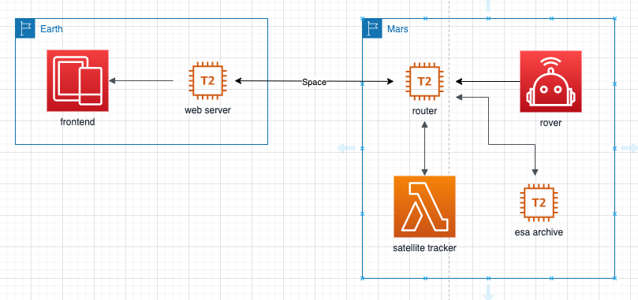

# NASA-SpaceApps-2020

Description | Value | Link
----------- | ------------ | ------------
Challenge   | Can You Hear Me Now? | https://2020.spaceappschallenge.org/challenges/connect/can-you-hear-me-now/details
Team        | HelloMars | https://2020.spaceappschallenge.org/challenges/connect/can-you-hear-me-now/teams/hellomars/project



Server | Endpoint
----------- | ------------
Mars Router | mars-router.hellomars.co
ESA Archive | esa-archive.hellomars.co
Satellite Tracker | satellite-tracker.hellomars.co

# Development

## Prerequisites

- [AWS CLI](https://docs.aws.amazon.com/cli/latest/userguide/cli-chap-install.html)

# Service Deployment

## Configuring AWS CLI

```bash
export AWS_ACCESS_KEY_ID=<access_key_id>
export AWS_SECRET_ACCESS_KEY=<secret_access_key>
export AWS_DEFAULT_REGION=<region>
```

How to deploy infrastructure stack:
```bash
STACK_NAME="nasa2020-canyouhearmenow"
aws cloudformation create-stack \
    --stack-name $STACK_NAME \
    --template-body file://infrastructure/infrastructure.yml \
    --capabilities CAPABILITY_NAMED_IAM
```

How to update infrastructure stack:
```bash
STACK_NAME="nasa2020-canyouhearmenow"
aws cloudformation create-change-set \
    --stack-name $STACK_NAME \
    --change-set-name=update-stack-$(date +%s) \
    --template-body file://infrastructure/infrastructure.yml \
    --capabilities CAPABILITY_NAMED_IAM
```

## Running Services

How to run satellite tracker:
```bash
ssh -A ubuntu@satellite-tracker.hellomars.co -i ~/.ssh/nasa-spaceapps-2020.pem
cd NASA-SpaceApps-2020/satellite_tracker/
npm install
sudo nohup node index.js &
```

How to run camera service:
```bash
ssh -A ubuntu@esa-archive.hellomars.co -i ~/.ssh/nasa-spaceapps-2020.pem
cd NASA-SpaceApps-2020/camera_service/
npm install
sudo HOSTNAME=esa-archive.hellomars.co nohup node index.js &
```

## Testing Services

Satellite Tracker:
```bash
curl -X GET http://satellite-tracker.hellomars.co:80
```

Camera Service:
```bash
curl -X POST -H "content-type: application/json" http://esa-archive.hellomars.co/takepic -d '{
  "alpha": 2.9
}'
```

# Attaching to instances
```bash
aws ssm start-session --target <instance_id>
```
