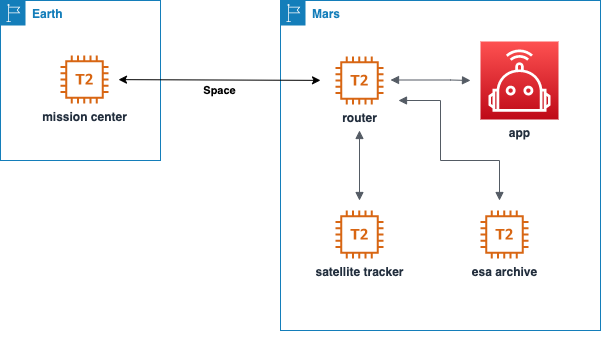

# NASA-SpaceApps-2020

Description | Value | Link
----------- | ------------ | ------------
Challenge   | Can You Hear Me Now? | https://2020.spaceappschallenge.org/challenges/connect/can-you-hear-me-now/details
Team        | HelloMars | https://2020.spaceappschallenge.org/challenges/connect/can-you-hear-me-now/teams/hellomars/project




# Development

## Prerequisites

- [AWS CLI](https://docs.aws.amazon.com/cli/latest/userguide/cli-chap-install.html)
- [sls](https://www.serverless.com/framework/docs/getting-started/)

# Deployment

## Configuring AWS CLI

```bash
export AWS_ACCESS_KEY_ID=<access_key_id>
export AWS_SECRET_ACCESS_KEY=<secret_access_key>
export AWS_DEFAULT_REGION=<region>
```

## Services

How to deploy/update satellite tracker:
```bash
sls deploy
```

How to deploy infrastructure stack:
```bash
STACK_NAME="nasa2020-canyouhearmenow"
aws cloudformation create-stack \
    --stack-name $STACK_NAME \
    --template-body file://infrastructure/infrastructure.yml \
    --capabilities CAPABILITY_NAMED_IAM
```

How to update infrastructure stack:
```bash
STACK_NAME="nasa2020-canyouhearmenow"
aws cloudformation create-change-set \
    --stack-name $STACK_NAME \
    --change-set-name=update-stack-$(date +%s) \
    --template-body file://infrastructure/infrastructure.yml \
    --capabilities CAPABILITY_NAMED_IAM
```

# Testing

To test Satellite Tracker execute:
```bash
sls invoke -f satellite_tracker --path data.json
```


#### SETUP SSM
